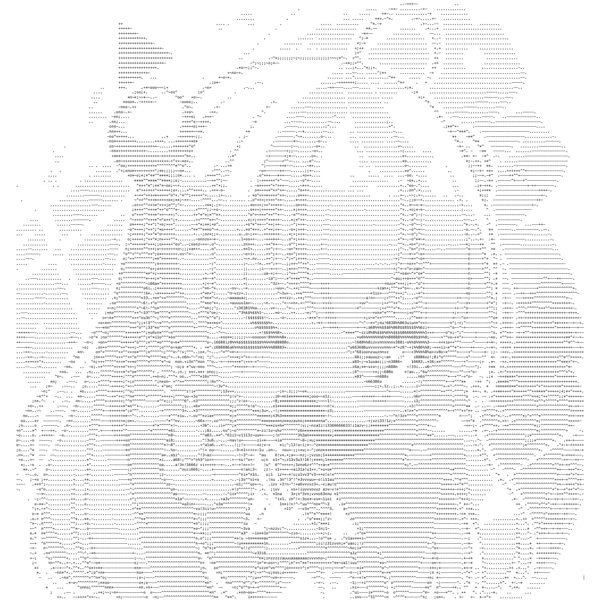

# char-dust

[](https://github.com/YunYouJun/char-dust/actions/workflows/gh-pages.yml)
[](http://npmjs.com/package/char-dust)

Convert image to char.

[示例 | Demo](https://yunyoujun.github.io/char-dust/)

> [由来 | Why char-dust?](https://www.yunyoujun.cn/posts/why-make-char-dust/)

<div align="center">




</div>

## Usage

```sh
yarn add char-dust
# npm install char-dust
```

### Browser

```html

```

```ts
import { imageToText, getImageData } from "char-dust";

const imageElement = document.getElementById("demo-image");
const imageData = getImageData(imageElement);
// const text = imageToText(imageData);
// default is "@#&$%863!i1uazvno~;*^+-. "
const text = imageToText(imageData, "@#&$%863!i1uazvno~;*^+-. ");
console.log(text);
```

### Node.js

#### Method 1: with node-canvas

If you use it in Node.js without document, you need `npm install canvas`.

```sh
yarn add canvas
```

> [node-canvas](https://github.com/Automattic/node-canvas): need [node-pre-gyp](https://github.com/mapbox/node-pre-gyp)

#### Method 2: without native dependencies

```sh
yarn add jimp @canvas/image-data
```

```ts
import path from "path";
import jimp from "jimp";
import ImageData from "@canvas/image-data";
import { imageToText } from "char-dust";

const imagePath = path.resolve(__dirname, "./cat-of-the-rebellion.jpg");
jimp.read(imagePath).then((image) => {
  // Magnify 5x
  image.scale(5);
  const imageData = new ImageData(
    Uint8ClampedArray.from(image.bitmap.data),
    image.bitmap.width,
    image.bitmap.height
  );

  const text = imageToText(imageData);
  console.log(text);
});
```

## Functions

- [x] Read Image
- [x] Scale Image
- [x] Convert to Char
- [x] Console
- [x] npm package
- [ ] Gif (may be you want [google/gif-for-cli](https://github.com/google/gif-for-cli))

## Todo

- 直方均衡化

## Ref

- [jscii](https://github.com/EnotionZ/jscii)
- [image-to-text](https://github.com/kainstar/image-to-text)
